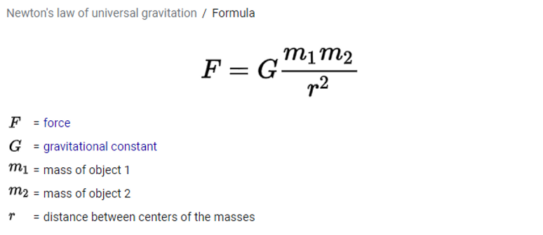
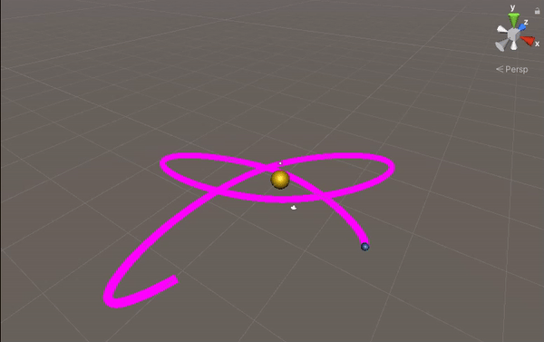
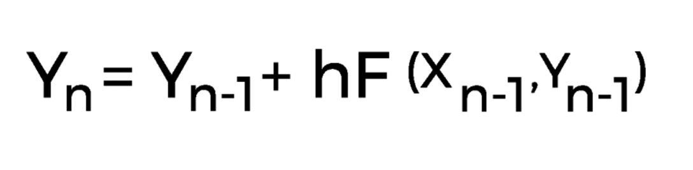
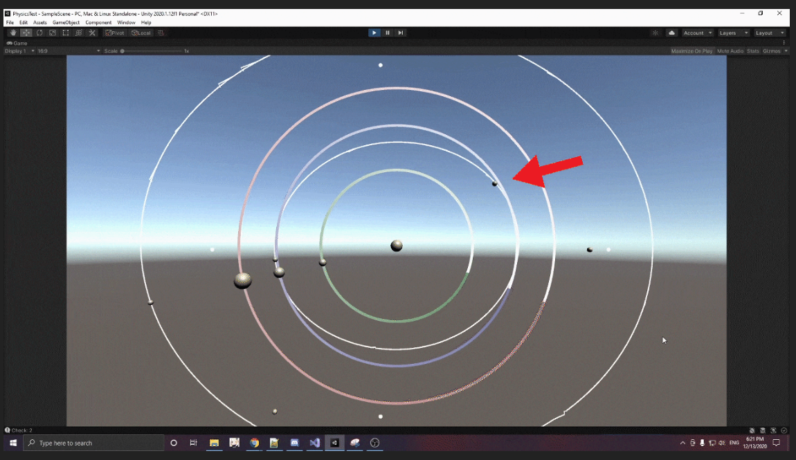

The original goal with this project was to simulate a solar system in Unity with our own physics engine. This means not using any colliders, rigidbody or any built in physics systems in Unity. With my partners Olli Machina and Charlie Kowalski, we tried to get the system working but couldn't quite get the math right in time. After hours of researching different equations and different ways other people had made something similar, we tried multiply methods but by the end, we ended up making a pendulum by accident instead of a solar system model.

---

# Orbit Using Transform Ver 1


In the beginning we tried one method which involved using the transform tool in Unity. It was a good start and gave us some basic math to start with, but wasn't very flexible in terms of adjustments. You also couldn't move the planet in the editor and watch it update itself. Instead it would just shoot back to where it was supposed to be which wasn't what we were going for.

```c#
void OrbitMath()
{
    transform.position = new Vector3(startingX + (semiMajor * MCos(alpha) * MCos(tilt)) - (semiMinor * MSin(alpha) * MSin(tilt)),
                                     startingY + (semiMajor * MCos(alpha) * MSin(tilt)) + (semiMinor * MSin(alpha) * MCos(tilt)));

    alpha += orbitSpeed;
}

float MCos(float value)
{
    return Mathf.Cos(Mathf.Deg2Rad * value);
}

float MSin(float value)
{
    return Mathf.Sin(Mathf.Deg2Rad * value);
}
```

---

# Orbit Using Transform Ver 2


Our next method expanded on the first one by using Newton's Law of Universal Gravitation. 



While this allowed for more customization in how the planet orbits around the sun, we still ran into the same issue of not being able to move the planet somewhere else and have gravity update its orbit, so we scrapped this version as well.

```csharp
// Force = (gravitational constant) * (mass1 * mass2 / distance^2)
void Orbit()
{
    distance = Mathf.Sqrt(Vector3.Distance(sunLocation.position, gameObject.transform.position));
    force = gravitationalConstant * ((planetMass * sunMass) / distance);
    transform.position = new Vector3((sunLocation.position.x + Mathf.Cos(angle) * force), (sunLocation.position.y + Mathf.Sin(angle) * force), 0f);
    angle = angle + Time.deltaTime * speed;

    if (angle >= 360)
    {
        angle = 0;
    }
}
```

---

# Orbit Using Pure Gravity Ver 1


We finally started to move on to making a system that purely used gravity to get the planets moving. We took the code from the previous example and tried using it as a basis for our new attempt. We got much closer in a way as it was being calculated based off of gravity so it could be moved in the editor, but it still wasn't quite right. The planets would go forward through the sun, and they didn't seem to properly come back around after a certain point.

```csharp
void Integrator()
{
    distance = Mathf.Sqrt(Vector3.Distance(sunLocation.position, gameObject.transform.position));
    force = gravitationalConstant * ((planetMass * sunMass) / distance);

    accumulatedForces.x += force * Time.deltaTime;
    accumulatedForces.y += force * Time.deltaTime;
    accumulatedForces.z += force * Time.deltaTime;

    transform.position += new Vector3((velocity.x / 200.0f), 0f, ((velocity.z / 200.0f) * Time.deltaTime));
    
    Vector3 resultingAcceleration = acceleration;
    resultingAcceleration += accumulatedForces * (planetMass / 1.6f);
    
    velocity += (resultingAcceleration * Time.deltaTime);
    
    float damping = Mathf.Pow(dampingConstant, Time.deltaTime);
    velocity *= damping;

    // Reset Accumulated Forces
    accumulatedForces = new Vector3(0.0f, 0.0f, 0.0f);
}
```

---

# Orbite Using Pure Gravity Ver 2



Moving on to our final version, this was the closest we were able to get in time. Using Euler's method, we were able to get the planets moving completely based off of gravity and in an elliptical rotation. However the planet still went through the sun in the beginning until it was able to form an ellipse and it didn't rotate around in one place. It ended up looking more like an atom with the way it kept moving its rotation. While our system didn't work the way we wanted it to in the end, we did realize we accidently made a pendulum instead of a solar system orbit. While that wasn't out goal, it was an interesting outcome.



```csharp
public class OrbitForceGenerator : ForceGenerator2D
{

    private float mGConstant;
    private float mPlanetMass1;
    private float mPlanetMass2;
    private Vector3 mCenterOfOrbit;

    public void Constructor(Vector3 centerOfOrbit, float gConstant, float planetMass1, float planetMass2)
    {

        mGConstant = gConstant;
        mPlanetMass1 = planetMass1;
        mPlanetMass2 = planetMass2;
        mCenterOfOrbit = centerOfOrbit;

    }

    public override void UpdateForce(GameObject obj)
    {

        Vector3 diff = mCenterOfOrbit - obj.transform.position;
        diff.Normalize();

        float dist = Vector3.Distance(mCenterOfOrbit, obj.transform.position);
        float distSQ = Mathf.Sqrt(dist);

        float force = (mGConstant * (mPlanetMass1 * mPlanetMass2)) / distSQ;

        addForce(obj, (diff * force) * Time.deltaTime);
        //Debug.Log(obj.name + " + diff");

        //Vector3 force = mGConstant * mPlanetMass1 * mPlanetMass2 / distSQ;
        //addForce(obj, force);

    }
}
```

---

# Attempting to Add Moons



On top of planets orbiting in a solar system, we also wanted to add something else. One idea was asteroids that would knock the planets off course, but we also came up with the idea to spawn in random moons and once a planet got close enough it'd be pulled into the planet and start orbiting it. Since we had less than a day to try implementing this, it led to some interesting results.


We started off by having each bullet create an array of all the planets in the scene once they were instantiated. Afterwards, we had them constantly checking to see if a planet was within range to it. Each planet already had a radius variable set to it, so we just took the Unity function Vector3.Distance() to calculate the distance from one another, and checked to see if it was within the planets set radius. Once it had found a planet, it stored the planet and its mass. With this, we tried reusing the the 2nd version of the orbit code that used transform to have it orbit the planet. While this semi-worked, the moon ended up following the planet more than it did going around it. It ended up just looking like another planet orbiting the sun in the end.

```csharp
// Start is called before the first frame update
void Start()
{
    inPlanetRadius = false;

    // Get all planets

    int i = 0;

    foreach (GameObject planet in GameObject.FindGameObjectsWithTag("Planet"))
    {
        activePlanets[i] = planet;

        i++;
    }
}
```

```csharp
void CheckIfInPlanetRadius()
{
    for (int i = 0; i < activePlanets.Length; i++)
    {
        Debug.Log("Check: " + i);
        if (Vector3.Distance(activePlanets[i].transform.position, transform.position) < activePlanets[i].GetComponent<EllipseMovementTest>().planetRadius)
        {
            planetMass = activePlanets[i].GetComponent<EllipseMovementTest>().planetMass;
            planetLocation = activePlanets[i];
            inPlanetRadius = true;
            break;
        }
    }
}

void Orbit()
{
    distance = Mathf.Sqrt(Vector3.Distance(planetLocation.transform.position, transform.position));

    force = gravitationalConstant * ((bulletMass * planetMass) / distance);

    transform.position = new Vector3(planetLocation.transform.position.x + Mathf.Cos(angle) * force, planetLocation.transform.position.y + Mathf.Sin(angle) * force / 2, 0f);

    angle = angle + Time.deltaTime * speed;

    if (angle >= 360)
    {
        angle = 0;
    }
}
```

---

## References

Albertkaruna. “How to Orbit an Object around Another Object in an Oval Path in Unity?” Game Development Stack Exchange, 13 Aug. 2016,  
[gamedev.stackexchange.com/questions/128141/how-to-orbit-an-object-around-another-object-in-an-oval-path-in-unity](gamedev.stackexchange.com/questions/128141/how-to-orbit-an-object-around-another-object-in-an-oval-path-in-unity)


Board To Bits Games. “Orbit Paths in Unity: Understanding Ellipses.” YouTube, YouTube, 12 June 2017, [www.youtube.com/watch?v=mQKGRoV_jBc](www.youtube.com/watch?v=mQKGRoV_jBc)


C, Ganapathy. “Moving an Object in a Circular Path.” Game Development Stack Exchange, 11 Mar. 2011, [gamedev.stackexchange.com/questions/9607/moving-an-object-in-a-circular-path/9610](gamedev.stackexchange.com/questions/9607/moving-an-object-in-a-circular-path/9610)


CookieKirby. “How Can I Make a Gameobject ‘Orbit’ Another.” Unity Answers, 17 Nov. 2013, [answers.unity.com/questions/585175/how-can-i-make-a-gameobject-orbit-another.html](answers.unity.com/questions/585175/how-can-i-make-a-gameobject-orbit-another.html)


Evgenii. “Programming a Simulation of the Earth Orbiting the Sun.” Evgenii.com, 30 Aug. 2016, [evgenii.com/blog/earth-orbit-simulation/](evgenii.com/blog/earth-orbit-simulation/)


Given, David. “2D Orbital Physics.” Stack Overflow, 27 Dec. 2010, [stackoverflow.com/questions/4038554/2d-orbital-physics](stackoverflow.com/questions/4038554/2d-orbital-physics)


MATH 5061: Fundamentals of Computer Programming for Scientists and Engineers. “Final Project: Planet Orbit Simulation.” Temple, 12 Dec. 2016, [sites.temple.edu/math5061/files/2016/12/final_project.pdf](sites.temple.edu/math5061/files/2016/12/final_project.pdf)


skyguy. “Unity 3D: Draw Line behind Game Object/Record Path Taken by Game Object?” Stack Overflow, 28 Apr. 2016,  [stackoverflow.com/questions/36923042/unity-3d-draw-line-behind-game-object-record-path-taken-by-game-object](stackoverflow.com/questions/36923042/unity-3d-draw-line-behind-game-object-record-path-taken-by-game-object)


tvoloshyn. “Orbiting Object around Orbiting Object.” Stack Overflow, 14 Nov. 2013, [stackoverflow.com/questions/19990146/orbiting-object-around-orbiting-object](stackoverflow.com/questions/19990146/orbiting-object-around-orbiting-object)


victorvijay. “Ho Do I Move an Object on an Elliptical Path?” Unity Answers, 22 June 2011, [answers.unity.com/questions/133373/moving-object-in-a-ellipse-motion.html](answers.unity.com/questions/133373/moving-object-in-a-ellipse-motion.html)


Zotov, Alexander. “Unity 2D Tutorial How To Make Platform To Move By Ellipse in Simple Platformer Game.” YouTube, YouTube, 16 Apr. 2018, [www.youtube.com/watch?v=SIM4g7P458E&ab_channel=AlexanderZotov](www.youtube.com/watch?v=SIM4g7P458E&ab_channel=AlexanderZotov) 