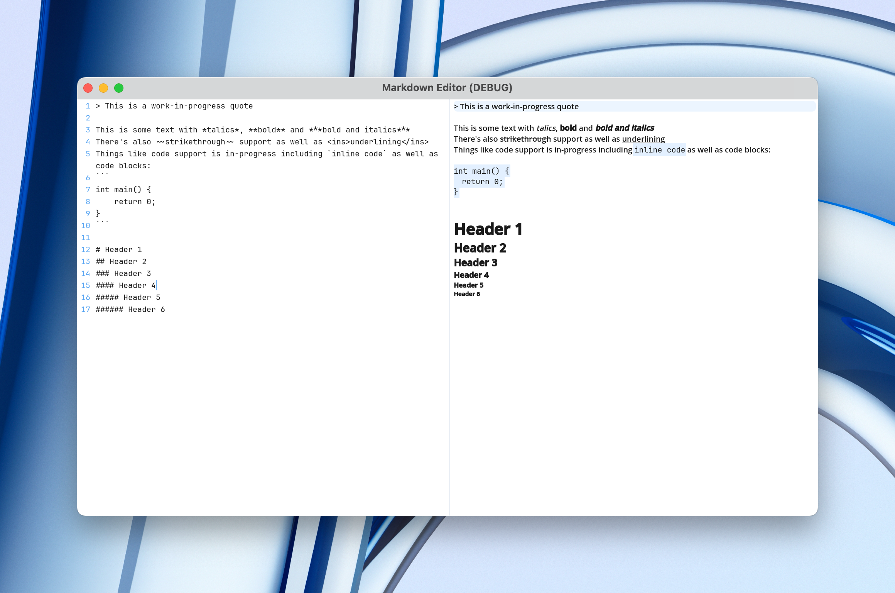

I've wanted to make my own markdown editor for a while, but have zero experience outside of game programming. I was about to learn react before I thought, wait, could I make one in Godot? The answer is possibly.

Of course, the most important part of a markdown editor is being able to render the markdown which Godot does not support natively. Instead, Godot supports it's own *bbcode* which is actually quite robust for a game engine. Many things like bold, italics, lists and code blocks are built in as well as some other extra features to mess with. For those not aware, here's a quick example of the difference between the two:

`**bold in markdown**` VS `[b]bold in bbcode[/b]`

When I first started this markdown editor, I knew converting the basics of bold, italic etc wouldn't be too difficult but it was way quicker then I thought it would take. Tahsnk to regex, swapping out the markdown for bbcode was pretty easy for the basics. But the easiness doens't last long. 

# Current Challenges

The first challenge was all about headers. Thankfully, they don't require *too much* tinkering. Godots bbcode already actually supports the ability to adjust font size, you can just use `[font_size=#][/font_size]`. So when adding in the headers, I just checked out how many "#" there are and change the size accordingly. Taking a look at other editors, I think I'll also need to go in and bold the headers as well, but that should be simple. Oh, I'll also remove the "#" from appearing, it's still in there for testing purposes but editors usually remove the "#" from view so I'll do the same.

The second and one of the bigger challenges is anything that requires some sort of highlighting affect, like inline code, code blocks, quotes and callouts. As you can see from the screenshot though, I'm getting close. I'll let you in on a secret though... the quote is at the top cuz it actually *doesn't work well the farther down the lines you go*. While Godots bbcode *does* include a way to highlight text, it's rather limiting and doesn't highlight the whole line just the word. While this works for the inline code, it doesn't work for things like quotes, callouts and code blocks. Hence why i've needed to look into creating my own system. I'll be honest, I thought this was the area that my experiement would fail at, but to my surprise I've been able to get close through using Godots `_draw()` function as well as the `draw_style_box()` function. It's not perfect, but considering how close I am I think it'll be doable.

# Future Challenges

While I've gone over what I'm working on right now, there are still more things that will have to be added that can prove to be a challenge. One major thing would be syntax highlighting for code blocks. Now, with the built int `[color][/color]` bbcode, ot is doable, but each languages syntax highlighter will have to be made from scratch. I haven't looked too far into this yet, since I'm confident that it is something that can be done, but just that a custom syntax highlighter will have to be made for each language.

Another challenge will be list. Even though Godot does have it's own bbcode for ordered and unordered lists, because of the nature of how it works it may be hard to use it directly. My main concern is having indented bullet points that mix with the numbers. I'm not sure how well Godots bbcode for this will be able to handle it as starting a new ordered list will reset the counter. Instead, I may come up with my own workaround, but I'll know more once I get to it and do some testing.

There are a small handful of other issues that I have yet to think too hard about as I focus on the current bigger issues at hand. Things like callouts I believe should be able to be implemented fine asuming I can finish up the way quotes are getting highlighted. Once I have that system down adding in anything with highlights should be relatively easier to do. Some other things though are things like links. Godots bbcode actually does include a link system, but I'll need to make sure it can support linking to not only website but also act as wikilinks (links to other md files in your project) as well as be able to jump to different headers. I'm sure I should be able to implement this though. Images should be rather simple (I hope) as again, Godots bbcode already has a solution to display images. There are things like footnotes, which I'm not too sure how to go about implementing. There are also tables to consider, with Godots current implementation making tables with headers may be hard, but it does have it's own table bbcode so maybe it'll be easier then it looks to implement.

Besides the basics, there are some extra things often seen in markdown editors that I have my reservation over the possibility of implementing. This includes two major systems: mermaid diagrams and LaTex. Considering the method I'm using to render the highlight coloring, I believe I may be able to implement a system to render mermaid diagrams, but I'm not too sure yet. And if I can, it'll be a rather complicated and daunting system to implement. It would surely take me a log time to do, so it's on the back burner for now as I want to see if I can get in all the basics for a markdown editor first. There's also the latex issue. I tried to look into any Godot plugins but none of them work with the `richtextlabel` and instead the one solution I had found uses it's own custom label and doesn't work on mobile devices. Through some basic research, I did have the idea to use a python script to generate a latex image and render that image into the `richtextlabel` but this is simply a passing though, as I'm really not sure how to go about it and haven't thought too deeply on it. Of course a benefit of Godot is that it's open source so I always *could* go into the code and add LaTex support to the engine directly, but that would be a pretty big undertaking as well. So, for now these challenges are seen as "one-day" issues for me to look further into for the future if part 1 (which is rendering github flavored markdown) is successful. 

# Unique Bonuses

As I stated earlier, I was going to dip my toes into React (since I hear that's what many use and there's a tutorial from a youtuber I really like about how to make a markdown editor in it) but I wanted to stick with a game engine if possible since it's simply what I'm used it. I took a look into React and man the learning curve looks big and I'm not sure I have the dedication for it right now with all the projects I'm doing. That's when I thought about Godot and whether or not it'd be possible to push it's capabilites to render markdown. I did find a markdown label addon, but I wanted to make mine from scratch for complete control and for a nice learning experience.

Making a markdown editor in Godot also means you have access to Godots bbcode which adds in sime nice addons that most marldown editors don't come with. For example, you can easily center/left/right some text with the `[center]`, `[left]` or `[right]` bbcodes. There's also a bbcode `[hint]` so a little textbox can appear over the word you hover. There's many others like `[outline_size]` and `[outline_color]` to add some outliens to text as well as `[bgcolor]` and `[fgcolor]` to color in text, so mimcing highlighting would be simple (as it's done for inline code currently). Another interesting ability is to change the font of a line with `[font]` and easily change the font size with `[font_size]`. While these are not in "official markdown" the possibility to be able to ues these in note taking would be quite interesting. And removing them from a file for let's say exporting your md notes to something like Obsidian, would be rather simple with regex. So if I or someone didn't want to ues this markdown editor anymore, it would still be easy to switch without worrying about the bbcode appeairng in your notes in other editors.

# FAQ

I already know there will probably be some questions about my little experiment, so I'll answer some of what Im expecting to be asked right now:

1. `Is the project open source?`

At the moment no, and I'm not sure if I plan on making it open source. Right now it's in very much a testing/prototype stage. Once I can have a full proof of concept working only then will I look into what I'll do with it in the future.

2. `Is it available to use?`

Currently no, as I said I just started this project yesterday at the time of writing this, and was surprised I got this far as is. But this has given me confidence that I could get at least a standard markdown editor working in Godot, with the other mermaid and LaTex compatibility being up in the air. Once I have a proper markdown editor working, I'll think about posting it for people to be able to use.

3. `Will this work on X platform?`

Since this currently is only making use of Godots built in bbcode, then it should work on any platform Godot supports. If this does come to fruition, I do plan on making it available for mobile after a dekstop release. So in other words, assuming this does get released one day, then it should be available on platforms like Windows, Mac and Linux on day one with mobile support coming later on, probably starting with iOS before then implementing it on Android.

4. `Why are you making a markdown editor when editors like Obsidian, Inkdrop, Deepdown (insert your markdown editor here) exists?`

For fun. I like coding and I like building things including tools. I currently use Obsidian but also really like some of the features of Inkdrop. I believe any programmer has had the experience of not finding a tool that works *exactly* how you want it and saying "Fine, I'll just do it myself" which is exactly whats happened here lol. So I want to make my own and I also am curious to see how far I can push Godot in this endeavor since I think it's a great tool to make applications as well. I'm excited with how far I've gotten and look forward to how much farther I can push this in the future.

---

And that's it! I'll continue to make future posts on the future of this tool and will make a special post if I ever do decide to release it to the public. I'm very excited for what the future of it contains though, as I feel like making mardkdown renderable in Godot is within reach! 