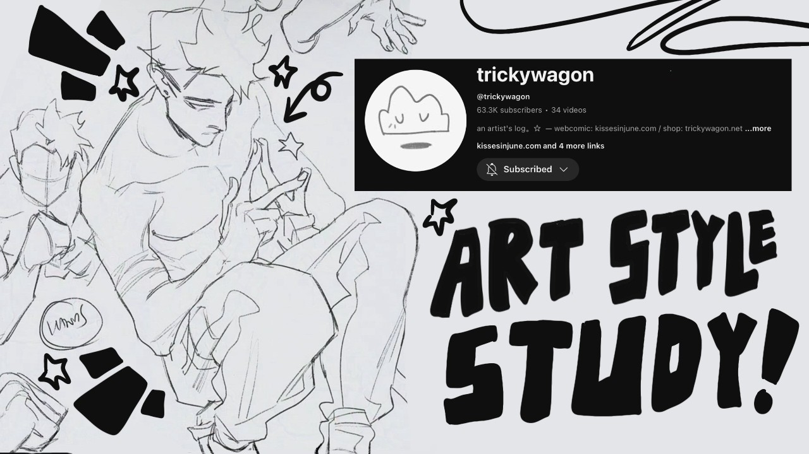

Three months ago I decided to give it a real shot at becoming an art-tuber. At 1 month I ended with 50 subscribers, at 2 months I ended with 200 subscribers and now I ended month three with ***1,195*** subscribers! So let's do a recap of how month 3 has gone since clearly a lot happened!

---

# Comparing Month 2 with Month 3

Despite a huge growth between month 2 and 3 I feel like my stats like AVD and CTR have remained more or less the same. It varies a bit but around 3%~ CTR on average and 20%~ AVD on average. Honestly I don't focus as much on these values anymore, as I mainly look for people enjoying my video and susbcribing instead. My best video, the one that blew up which is a Trickywagon Art Style Study is on the lower end of 18.8% AVD but a nicer 4.2% CTR. Meanwhile other videos with better stats have less views so I don't think it's such a tight one to one in terms of video performance. 

I mainly want a community that enjoys my art and ideas so as long as that's happening I'm content, CTR and AVD can just help in that if something seems wrong. Engagement on my community posts has risen especially on polls so I think my community is continuing to grow! I'm also recognizing some new commenters that comment multiple times which is always really cool to see.

---

# Evergreen Content from Month 1

If we look back at my main evergreen video which is a "starting a new sketchbook" video, it's reached *7,285* views **BUT** since the end of september it's views has basically stopped, with only 2-10 views a day now. I don't know why, I assumed it's growth would eventually stop but the stop was quite sudden. I'm not sure if that's just the video staying it's welcome or because my art style studies were doing well it stopped pushing the video. Even though I'm sad to see it's growth stop I am glad it happened at all as it was a main driver to my channel in my first two months :)

---

# Analytics

Okay now let's get into Months 3 anayltics. Even though I started the month off strong I definitely had a messier upload schedule towards the end. I'm not sure how much that affected my channel but I want to fix that for Month 4 anyways.

| Video    | Views     | AVD (%) | CTR | Impressions | Likes | Comments | Subscribers Gained |
| -------- | --------  | ------- | ------ | ------ | ------ | ------ | ------ |
| `Sketch Inktober Ideas with Me` | 793 | 25% | 3.6% | 16.2k | 30 | 5 | 6 |
| `How to CRUSH Inktober` | 608 | 33.3% | 3.8% | 11.6k | +27 -1 | 5 | 9 |
| `How to Draw like BlueBiscuits`  | 4,203 | 25.2% | 3.3% | 94.1k | +370 -3 | 29 | 100 |
| `Old SKetchbook Tour` | 359 | 11.9% | 2.6% | 9.4k | 15 | 8 | 2 |
| `2 Months as a Youtuber` | 317 | 19.4% | 1.5% | 15.5k | 38 | 15 | 33 |
| `How to Draw like Trickywagon` | 13,896 | 18.8% | 4.2% | 234.6k | +1,224 -5 | 39 | 396 |
| `Redrawing Old Art and Failing` | 399 | 20.5% | 2.3% | 12.1k | 33 | 5 | 4 |
| `How to Beat Perfectionism in Art` | 319 | 26.5% | 3.1% | 7.7k | 33 | 11 | 7 |
| `How to Draw like Kuroshiro` | 326 | 26.1% | 3.1% | 7.7k | 29 | 6 | 7 |
| `I Draw an Yap About Ananta` | 116 | 11.9% | 2.4% | 2.9k | 11 | 2 | 1 |
| `Drawing Emo Boy Flins` | 213 | 12.7% | 3.2% | 5.3k | 21 | 7 | 2 |

What can we tell form this data?
1. My inktober prep videos did surprisingly well, most likely since it's inktober season and even brought in subscribers!
2. I usually hit anywhere from 100-300 views a video
3. My youtuber growth video has done surprisingly well again with a high subscriber turn over for some reason
4. Despite my art style studies doing well before, my kuroshiro video has done terribly in comparison but still better than my average video would do before so I can't complain!

---

# Pleasant Surprises

My Trickywagon video absolutley ***blew-up*** this month surpassing 10k views in just a week! I know the thumbnail is nice and I've had two prior successful videos in the series but I'm still *shocked* by the results. I honestly wondered how well it'd do since I think Trickywagon may be a more niche artist. While they have a youtube channel with ~60k subscribers they hardly ever post and they hardly post on other social media as well so I didn't expect to see so many fans curious! I guess I'm not the only dedicated Trickywagon fan and she has a rather dedicated fanbase!

Despite the video skyrocketing my channel to 1k subscribers, it did have it's downsides. Instead of being able to slowly grow a tight community I gained many subscribers so fast everythings felt a bit out of sync from it. Before I could see each video doing better and better as my subscribers slowly grew but after growing so fast it's hard to have a reference point for anything. I know as you grow it's inevitable that you have more casual fans than dedicated ones but I think the sudden jump threw me for a loop and I'm still trying to adjust my expectations for what to expect on each videos performance.

---

# Disappointing Surprises

I try my best after a blow-up video to *not* expect the same thing to happen again, but after three entries in my "Art Style Studies" series doing so well, it became hard *not* to have high expectations. After my Tricykwagon video hit 10k, I didn't expect the same for kuroshiro but since every episode in the series had hit 1k I had expected it to also hit that. So when it barely hit 300 views I was really surprised and taken aback. Even now when I write this already into Month 4 it's barely gone up and has yet to hit the 500 views mark. I actually thought the video came together nicely, people seemed to like it and I thought the thumbnails were nice, on top of using the same title format and the artist being a popular artist I had expected it to perform similarly to TBHK or BlueBiscuits. 

So why did it not do well? Well... I honestly have no clue. I have heard that since my channel blew up so much at once there could be a brief cooldown period as it sorts itself out. Kuroshiro is a popular artist on instagram and a fellow youtuber like BlueBiscuits, so I really have no clue why it wouldn't do as well. That being said I don't think about it much since there's not much else for me to breakdown. I think the video came out well, although a day later than usual so all I can do is move on so I don't get bogged down by underperforming videos which is something I'm trying to avoid falling into.

---

# Big Achievements this Month

1. Hit 1,000 subscribers!
2. Had multiple videos break 1k views!
3. Community posts consistently get engagement so despite my sudden growth Im still buiding myself a nice community!

---

# Steps Moving Forward

First let's do a recap of my third month.

(Avg video length ~10 - 15m)

| # of Videos | Subscriber Growth | Watch Time | Views | Avg AVD | Avg CTR | # of Comments | Like-to-Dislike Ratio |
| -------- | --------  | ------- | ------ | ------ | ------ | ------ | ------ |
| 11 | 203 -> 1,195 (+992) | 1.4k | 30k | 21% | 2.6% | 132 | 1.831 to 9 |

Alright let me go over my next months plans:

1. **Work on Consistency:** I started to fall off my three upload a week schedule I had been keeping up which is really disappointing for me. Even though part of the reasons were out of my control (life got busy!) I still want to do better by working more on pre-scheduling videos and trying to work on them faster so I can create some buffer for myself as currently I have no buffer.

2. **Reach 1.5k Subs:** Even though I had a huge growth spurt my growth *did* slow down a lot a week or so after my Trickywagon video so I don't expect to grow nearly that much this month. That said I'll make a stretch goal of 1.5k subs but a more realistic goal is probably 1.3k maybe?

3. **Keep Making Community Posts:** Of course, I want to keep up my community posts as I definitely think it helps me build a strong community, I've been doing almost daily so I plan on continuing that.

---

# Conclusion

[Last update](https://minoqi.vercel.app/posts/youtube/two-months-on-youtube-art-2025/) I had said how that month had been incredible growth wise but WOW did I out do myself this month! My growth has slowed down now and I think is stabilizing again, but I'm excited to see where this goes next month! Update will be out in November 👀 