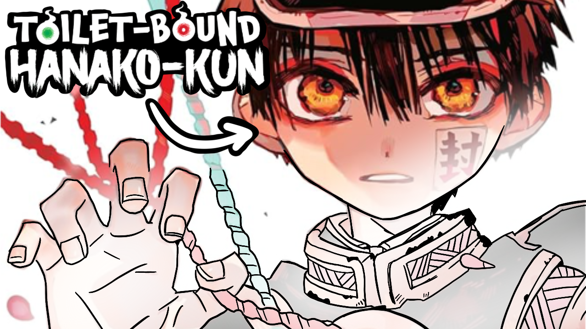

Two months ago I decided to give it a real shot at becoming an art-tuber. At 1 month I got used to a schedule, figured out the style a videos I like making and started on my journey ending the month with 50 subscribers. Now a month later I've furthered refined my style of content, improved my eiditng and thumbnails and more importantly ended the month with ***203*** subscribers! So let's do a recap of how month 2 has gone.

---

# Comparing Month 1 with Month 2

In Month 1 most of my vids only reached 20-30 views with a few sticking out to reach over 100 views. I wasn't gaining a subscriber per video, most of my subscribers would come from my "New Sketchbook" video with some trickling in from other videos. My CTR hovered around 1-2% on average. But most importantly I had gained my first real loyal subscriber as they would like and comment on all my videos as well as my community posts. And like I said I ended the month having just reached 50 subscribers and uploading twice a week.

Now compared to Month 2 my videos consistently end up around 60-70~ views with a good amount reaching past 100. I also *usually* get at least one subscriber per video, but a few have gained me 7-8 new subscribers with a few not gaining any subscribers. My CTR is still a bit all over the place but for my last few videos their CTR has been not bad at around 3-4% which is better than 1-2% so I'll take it. My AVD has gotten rather steady at around ~20% on average with a few being on the higher end. Most surpsingly, I ended the month with 203 subscribers, that's a ***4x*** increase from last month which is insane to think about!

---

# Evergreen Content from Month 1

In Month 1 I had posted a few "evergreen" style content, and I'll tell you now the "New Sketchbook" video has done *extremely* well and is still a major drive to my channel. I honestly don't know where I'd be without it!

At the end of Month 1 it had 532 views, it now sits at ***3.4k views*** and has gained me 81 subscribers. It's CTR goes up and down but it stays around 4-6%, currently at 5.5%. The AVD hasn't changed much, sitting at 21%. While it hasn't gained any new comments it does now sit at 182 likes (and 1 dislike). I'm surprised how well this video is doing, and it's now gaining around 400 views *every 48 hours*. I imagine it'll hit 5k views and 100 subs gained by the end of month 2!

Outside of that there are two others, my "sketchbook #1 tour" and my "jusart acrylic markers review" video. Both are growing slowly, but still gaining veiws. They both increased by around 200~ views by the end of the month sitting in the high 400s. I doubt either will start growing very fast, and between the two I imagine it'd be the sketchbook tour one, but since they've steadily grown over a month I imagine that'll continue, esp as long as jusart acrylic markers stay popular.

---

# Analytics

Okay now let's get into Months 2 anayltics. Reminder that I started uploading 3 videos a week instead of 2 as well! I've included more analytics than last time to give a better overview as well as ordered them from start of the month to the end of the month.

| Video    | Views     | AVD (%) | CTR | Impressions | Likes | Comments | Subscribers Gained |
| -------- | --------  | ------- | ------ | ------ | ------ | ------ | ------ |
| `Semantic Error Fanart` | 67 | 24.7% | 1.2% | 3k | 6 | 2 | 0 |
| `Designing a Postman OC` | 97 | 29.1% | 1.5% | 5k | 9 | 7 | 3 |
| `1 Month as a Youtuber`  | 101 |19.8% | 1.5% | 4.7k | 10 | 7 | 8 |
| `Designing a Knight OC` | 84 | 25.9% | 1.4% | 4.3k | 6 | 5 | 1 |
| `10 Ways to Beat Art Block` | 183 | 29.8% | 2.5% | 5.7k | 17 | 5 | 8 |
| `Static Wool DTIYS` | 67 | 19.8% | 1.6% | 3.3k | 4 | 1 | 1 |
| `Ohuhu Pastel Markers` | 191 | 19.4% | 2.2% | 7k | 8 | 8 | 3 |
| `PNGTuber` | 70 | 20% | 1.7% | 3k | 3 | 2 | 0 |
| `Meet the Artist` | 73 | 16.2% | 2.3% | 2.5k | 9 | 3 | 0 |
| `Start a New Sketchbook for Ideas` | 247 | 23% | 3.3% | 5.3k | 25 | 8 | 7 |
| `TBHK Art Style Study` | 601 | 16.4% | 3.3% | 10.6k | 61 | 9 | 4 |

What can we tell form this data?
1. I usually gain over 3 subscribers a video now, with only 3 not gaining any and 2 not hitting 3 subscribers
2. I'm steadily passing 60 views a video, usually being closer to 70-100 with a few breaking past the 100 mark
3. I have a strong likes-to-views ratio ending up around 6-10% on average (which from what I can tell online is quite high)
4. The engagement in the forms of comments is steadily increasing as I now get a few comments a video on average
5. I had a video truly blow up, having already over 600 views in just 4-5 days with no signs of slowing down yet

---

# The Blow-Up Video

The last video I posted was an art style study vidoe about how to replicate TBHKs art style and it's absolutely ***blown up*** for my channel. At first, it gained views very slowly, it was ranked at the bottom of my video performances, but next thing I know I check after the weekend (so about 2-3 days later) and it had hit over 400 views and just a day or two later we're past 600. Not only that but it has a lot of supportive comments as well as a lot of likes. Subscribers gained is not high but that makes sense as this is a specific tutorial people are looking for so you're less likely to get subscribers from it but it introduces people to my channel and has still gained me 4 subs so far.

Usually, peoples videos will die out in growth after the first 2-3 days. I have a few that have managed to still slowly climb in views consistently everyday, but more often then not they stop growing. Not only has this continued to grow but we're into the 5th day since upoad and it's *still* growing at about 380 new views every 48 hours which is ***insane***. It shows no signs of stopping or slowling down so it could easily hit 1k by the end of the week if it continues. Honestly, I never expected this video to do as well as it has so I'm kinda shocked but of course very happy with it. Since it's done so well I'm already working on my next art style video and I'm curious to see how they compare. TBHK has a very dedicated fandom and there aren't a lot of proper tutorials for the style so I think this has contributed greatly. I'm excited to see where it'll go by the end of the month and I can only hope it doesn't slow down!

---

# Big Achievements this Month

1. Hit 100 subscribers!
2. Hit 200 subscribers!
3. Had my first video hit 1k!
4. AVD has gone up generally consistently!
5. Had my first blow-up video!
6. Community posts consistently get engagement so I think I'm building a community!

---

# Steps Moving Forward

First let's do a recap of my second month

(Avg video length ~5 - 10m)

| # of Videos | Subscriber Growth | Watch Time | Views | Avg AVD | Avg CTR | # of Comments | Like-to-Dislike Ratio |
| -------- | --------  | ------- | ------ | ------ | ------ | ------ | ------ |
| 11 | 50 -> 203 (+153) | 242.5 | 6.8k | 2:49 | 3.6% | 57 | 149 to 0 |

Alright let me go over my next months plans and if you're a subcriber consider this a sneak peek 🤭

1. **Post More Art-Style Study/Tutorials:** Considering my success of my TBHK video, it'd be crazy not to make more of this style. I don't mind these videos and plan to post one weekly on Fridays, that way it'll be a nice thing for viewers to look forward to, hopefully a nice strema of evergreen content for me all while not making up the bulk of what I post

2. **Work on Backlog:** Generally, I'm good at getting a weeks of videos ready at the start of the week but then I slow down in the second half. I'd still really like to be able to make a nice backlog of two weeks for myself at least

3. **Reach 350-400 Subs:** Now, gonna be honest, I grew so much that I'm not sure what a realistic goal is anymore. Will I continue to have this growth? Will it quicken? I honestly have no clue. My videos are consistently doing better performance wise and my "New Sketchbook" video from Month 1 continues to grow so I'm hoping maybe 400 subscribers? Or 350? Somewhere around there. I don't want to get my hopes up but that'd be super cool. I definitely don't think I'd hit 500, but 400 would be ***amazing***

4. **Keep Making Community Posts:** Of course, I want to keep up my community posts as I definitely think it helps me build a strong community, I've been doing almost daily so I plan on continuing that

---

# Conclusion

Thank god this was much shorter than my [last one](https://minoqi.vercel.app/posts/youtube/one-month-on-youtube-art-2025/). My growth this month has been incredible and I can only hope it carries into Month 3. That being said make sure to come back in October for the Month 3 update 👀